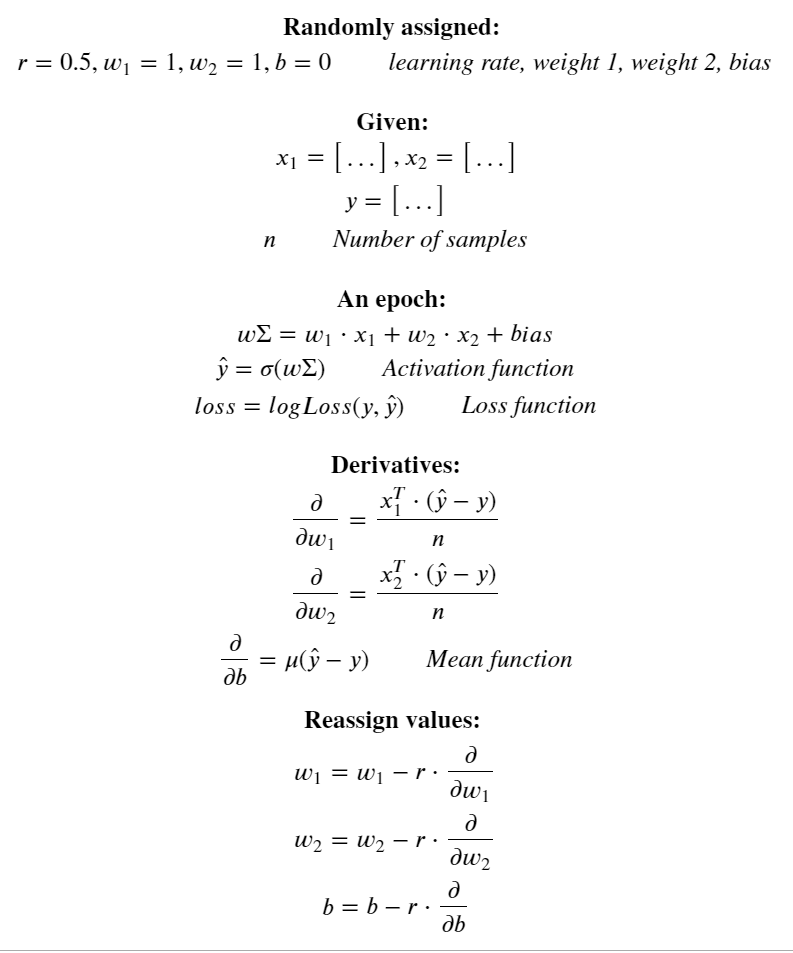

# Neural Network From Scratch

Created a simply one layered neural network from scratch. Then comparing its performance relative to tensorflow's.

## Gradient Descent Algorithm

### Math:

<center>
  </img>
</center>

### Code:

Given Values:
```python
X, y, epochs=500, loss_threshold=0.45
```
```python
X = [X[X.columns[i]] for i in range(len(X.columns))]
n = len(X)
```

Randomly Assigned Values:
```python
w = [1 for i in range(n)]
b = 0
r = 0.5
```

Calculating Derivatives:
```python
for i in range(epochs):
    # weighted sum
    weighted_sum = 0

    for j in range(n):
        weighted_sum += w[j]*X[j]

    weighted_sum += b

    # y hat
    y_hat = sigmoid_numpy(weighted_sum)

    # loss
    loss = log_loss(y, y_hat)
    # derivatives
    wd = [(1/len(X[j]))*np.dot(np.transpose(X[j]), (y_hat-y)) for j in range(n)]
    bd = np.mean(y_hat-y)
```

Reassignment: 
```python
    # reassign
    w = [w[j] - r * wd[j] for j in range(n)]
    b = b - r * bd

    # print & break

    if i%50 == 0:
        print(f'Epoch:{i}, loss:{loss}')

    if loss<=loss_threshold:
        print(f'Epoch:{i}, loss:{loss}')
        break
```

